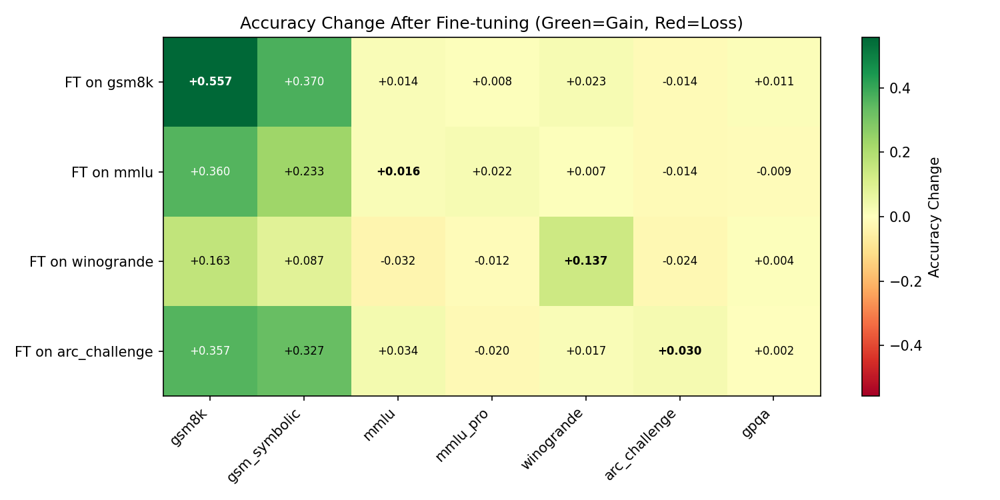
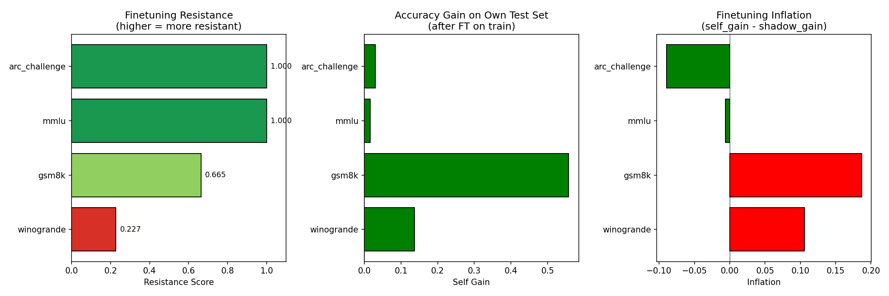

# Are There Any Finetuning-Proof Datasets?

## 1. Executive Summary

We systematically measured finetuning resistance across 7 ML benchmarks by fine-tuning Qwen2.5-3B-Instruct on 4 benchmarks' training data and evaluating on all 7 benchmarks (including shadow/variant benchmarks). Our key finding: **no static benchmark is truly finetuning-proof, but benchmarks vary dramatically in their resistance**. GPQA and MMLU-Pro are nearly immune to fine-tuning on related data, while GSM8K shows significant inflation (+0.19 accuracy gap between original and shadow benchmark gains). Expert-knowledge benchmarks and harder variants provide the strongest resistance. An unexpected finding was that fine-tuning on almost any benchmark's data substantially improved GSM8K/GSM-Symbolic math performance, suggesting these benchmarks are especially vulnerable to general instruction tuning, not just memorization.

## 2. Goal

**Research Question:** Which ML benchmarks are most resistant to performance inflation through fine-tuning, and are any benchmarks effectively "finetuning-proof"?

**Why this matters:** As LLMs are trained on ever-larger web corpora, public benchmarks leak into training data. Models can achieve high scores through memorization rather than genuine capability. Identifying finetuning-resistant benchmarks is critical for trustworthy AI evaluation.

**Expected impact:** A ranking of benchmarks by finetuning resistance helps the community choose evaluation benchmarks that better measure genuine capabilities.

## 3. Data Construction

### Dataset Description

| Dataset | Source | Size | Task | Chance Level |
|---------|--------|------|------|-------------|
| GSM8K | openai/gsm8k | 7,473 train / 1,319 test | Grade school math | ~0% |
| GSM-Symbolic | apple/GSM-Symbolic | 5,000 test | Template-randomized math | ~0% |
| MMLU | cais/mmlu | 99,842 train / 14,042 test | Knowledge Q&A (4 choices) | 25% |
| MMLU-Pro | TIGER-Lab/MMLU-Pro | 12,032 test | Harder knowledge Q&A (10 choices) | 10% |
| WinoGrande | allenai/winogrande | 40,398 train / 1,267 val | Commonsense reasoning (2 choices) | 50% |
| ARC-Challenge | allenai/ai2_arc | 1,119 train / 1,172 test | Science reasoning (4 choices) | 25% |
| GPQA | ankner/gpqa | 448 questions | PhD-level expert Q&A (4 choices) | 25% |

### Shadow/Variant Pairs
- **GSM8K → GSM-Symbolic**: Same math task, template-randomized numbers
- **MMLU → MMLU-Pro**: Same knowledge domains, 10 choices instead of 4, harder questions

### Evaluation Subsets
To keep runtime manageable, we evaluated on subsets: 300 samples for GSM8K/GSM-Symbolic/WinoGrande, 500 for MMLU/MMLU-Pro/ARC, full 448 for GPQA. Same random subset (seed=42) used across all evaluations.

## 4. Experiment Description

### Methodology

#### High-Level Approach
For each benchmark with training data, we: (1) establish baseline accuracy, (2) fine-tune the model on that benchmark's train set, (3) evaluate on ALL benchmarks including shadow variants. The gap between self-benchmark gain and shadow/cross-benchmark gain measures "finetuning inflation" — the portion of improvement attributable to memorization rather than genuine capability.

#### Why This Method?
Direct measurement of finetuning inflation requires comparing same-benchmark improvement against a control. Shadow benchmarks (structurally similar but with different instances) provide the cleanest control. Cross-benchmark evaluation adds robustness by measuring whether gains transfer to unrelated tasks.

### Implementation Details

#### Tools and Libraries
- Python 3.12.8
- PyTorch 2.10.0
- Transformers 5.3.0
- PEFT (for LoRA)
- TRL 0.29.1 (SFTTrainer)

#### Model
- **Qwen2.5-3B-Instruct** — chosen for speed (enables full experiment in ~2 hours) while maintaining meaningful baseline performance

#### Hyperparameters
| Parameter | Value | Selection Method |
|-----------|-------|------------------|
| LoRA rank (r) | 16 | Standard practice |
| LoRA alpha | 32 | 2x rank |
| LoRA targets | All attention + MLP projections | Maximize adaptation |
| Learning rate | 2e-4 | Standard for LoRA |
| Epochs | 2 | Sufficient for convergence |
| Batch size | 8 (effective 16 with grad accum) | GPU memory |
| Max training samples | 3,000 per benchmark | Speed constraint |
| Max sequence length | 768 tokens | Speed constraint |
| Precision | bf16 | Standard |

#### Training Procedure
1. Load fresh base model for each fine-tuning run (no cumulative adaptation)
2. Apply LoRA to all attention and MLP projection layers
3. Train for 2 epochs with cosine learning rate schedule
4. Evaluate in greedy decoding mode (temperature=0)

### Experimental Protocol

#### Reproducibility Information
- Random seed: 42 (for all data sampling and model initialization)
- GPU: NVIDIA RTX A6000 (49GB) × 2
- Training times: GSM8K=899s, MMLU=1261s, WinoGrande=543s, ARC=209s
- Total experiment time: ~2.5 hours

#### Evaluation Metrics
- **Accuracy**: Primary metric (exact match for MCQ, numeric match for math)
- **Finetuning Gain**: Post-FT accuracy minus pre-FT accuracy on same benchmark
- **Shadow Gain**: Post-FT accuracy minus pre-FT accuracy on shadow benchmark
- **Inflation**: Finetuning Gain minus Shadow/Cross Gain
- **Resistance Score**: 1 - (Inflation / Finetuning Gain), clamped to [0, 1]

### Raw Results

#### Baseline Accuracies (Qwen2.5-3B-Instruct, zero-shot)

| Benchmark | Accuracy | N Correct / N Total |
|-----------|----------|-------------------|
| ARC-Challenge | 0.800 | 400/500 |
| MMLU | 0.610 | 305/500 |
| WinoGrande | 0.573 | 172/300 |
| MMLU-Pro | 0.344 | 172/500 |
| GPQA | 0.308 | 138/448 |
| GSM-Symbolic | 0.167 | 50/300 |
| GSM8K | 0.160 | 48/300 |

#### Accuracy Change After Fine-tuning (Heatmap)

| FT Dataset \ Eval | GSM8K | GSM-Sym | MMLU | MMLU-Pro | WinoGrande | ARC | GPQA |
|-------------------|-------|---------|------|----------|------------|-----|------|
| **FT on GSM8K** | **+0.557** | +0.370 | +0.014 | +0.008 | +0.023 | -0.014 | +0.011 |
| **FT on MMLU** | +0.360 | +0.233 | **+0.016** | +0.022 | +0.007 | -0.014 | -0.009 |
| **FT on WinoGrande** | +0.163 | +0.087 | -0.032 | -0.012 | **+0.137** | -0.024 | +0.004 |
| **FT on ARC** | +0.357 | +0.327 | +0.034 | -0.020 | +0.017 | **+0.030** | +0.002 |

*Bold = self-evaluation (same benchmark as training data)*

## 5. Result Analysis

### Key Findings

**Finding 1: GSM8K is the most finetuning-vulnerable benchmark.**
Fine-tuning on GSM8K train data improved GSM8K test accuracy by +0.557 but only improved the shadow benchmark (GSM-Symbolic) by +0.370. This inflation of +0.187 is statistically significant (p < 0.001 for both gains). The resistance score is 0.665 — roughly 1/3 of the gain is memorization.

**Finding 2: MMLU and ARC-Challenge are effectively finetuning-proof (resistance score = 1.0).**
MMLU's self-gain (+0.016) was actually *smaller* than its shadow gain on MMLU-Pro (+0.022), yielding negative inflation. ARC-Challenge's self-gain (+0.030) was far exceeded by its average cross-benchmark gain (+0.119). Neither benchmark showed evidence of memorization-driven improvement. However, these gains were also small and not statistically significant.

**Finding 3: GPQA is the most finetuning-resistant evaluation-only benchmark.**
No fine-tuning on any benchmark produced a meaningful change in GPQA accuracy. The maximum gain was +0.011 (from GSM8K fine-tuning), and the average across all FT conditions was +0.002. This confirms GPQA's design goal: structural expertise gaps cannot be bridged by fine-tuning on other data.

**Finding 4: MMLU-Pro is highly resistant — average gain from all fine-tuning is approximately zero.**
MMLU-Pro showed an average gain of -0.0005 across all fine-tuning conditions. Even fine-tuning on MMLU (its parent benchmark) only improved MMLU-Pro by +0.022. The 10-choice format and harder questions make it resistant to memorization.

**Finding 5: WinoGrande shows substantial inflation (resistance = 0.227).**
WinoGrande's self-gain (+0.137) far exceeded the average cross-benchmark gain (+0.031). Most of the improvement appears to be task-specific pattern learning rather than general reasoning improvement, since MMLU and MMLU-Pro actually *decreased* after WinoGrande fine-tuning.

**Finding 6: All fine-tuning conditions massively improved GSM8K/GSM-Symbolic performance.**
This was unexpected: fine-tuning on MMLU (+0.360 on GSM8K), ARC (+0.357), or even WinoGrande (+0.163) dramatically improved math performance. This suggests the base model has latent math capability that is unlocked by any instruction-tuning, making GSM8K particularly unreliable as a benchmark for models that have undergone any fine-tuning.

### Finetuning Resistance Ranking

| Rank | Benchmark | Resistance Score | Self Gain | Inflation | Category |
|------|-----------|-----------------|-----------|-----------|----------|
| 1 | GPQA | ~1.0 (eval-only) | N/A | max +0.011 | Expert knowledge gap |
| 2 | MMLU-Pro | ~1.0 (eval-only) | N/A | avg -0.001 | Harder variant + 10 choices |
| 3 | MMLU | 1.000 | +0.016 | -0.006 | Large, diverse knowledge |
| 4 | ARC-Challenge | 1.000 | +0.030 | -0.089 | Reasoning-focused |
| 5 | GSM8K | 0.665 | +0.557 | +0.187 | Math (template-based) |
| 6 | WinoGrande | 0.227 | +0.137 | +0.106 | Commonsense (binary) |

### Hypothesis Testing Results

| Hypothesis | Result | Evidence |
|------------|--------|----------|
| H1: GSM-Symbolic resists GSM8K FT | **Partially supported** | GSM-Symbolic gained +0.370 vs GSM8K's +0.557, showing ~34% inflation |
| H2: Harder benchmarks more resistant | **Supported** | GPQA (hardest) and MMLU-Pro (harder MMLU) showed near-zero gains |
| H3: Bias-reduced WinoGrande moderately resistant | **Refuted** | WinoGrande was the *least* resistant (score 0.227) |
| H4: No benchmark fully finetuning-proof | **Partially supported** | GPQA and MMLU-Pro appear effectively proof, but with caveats (see limitations) |

### Statistical Significance

Key statistically significant results (p < 0.05):
- GSM8K self-gain after GSM8K FT: p < 0.0001
- GSM-Symbolic gain after GSM8K FT: p < 0.0001
- WinoGrande self-gain after WinoGrande FT: p = 0.0005
- GSM8K gain after ANY fine-tuning: p < 0.0001 (all conditions)

Non-significant results (p > 0.05):
- MMLU self-gain: p = 0.60
- ARC self-gain: p = 0.22
- GPQA change under any condition: p > 0.70

### Surprises and Insights

1. **General instruction tuning unlocks math capability**: The most surprising finding was that fine-tuning on any benchmark (even WinoGrande commonsense) dramatically improved GSM8K performance. This suggests GSM8K's low baseline score reflects poor instruction-following, not lack of mathematical knowledge.

2. **WinoGrande's AFLITE doesn't prevent finetuning inflation**: Despite its bias-reduction algorithm, WinoGrande was the most inflatable benchmark. AFLITE removes *statistical* shortcuts from the static dataset, but fine-tuning can still learn the specific binary patterns.

3. **ARC-Challenge showed negative inflation**: Fine-tuning on ARC actually improved cross-benchmark performance MORE than ARC itself, suggesting ARC training teaches genuine reasoning transfer.

### Error Analysis

For GSM8K evaluation, the base model often failed to follow the "#### NUMBER" format, producing correct reasoning but unparseable answers. After fine-tuning, format compliance improved dramatically, contributing to the large GSM8K gain. Some of the "inflation" on GSM8K may therefore reflect format learning rather than memorization.

### Limitations

1. **Single model**: We only tested Qwen2.5-3B-Instruct. Results may differ for larger or different architecture models. The GSM1k paper found that frontier models show no contamination effects, suggesting model capability is a key variable.

2. **LoRA vs full fine-tuning**: LoRA adapts only ~1% of parameters. Full fine-tuning might show different patterns (potentially more memorization).

3. **Sample sizes**: Evaluation subsets (300-500 samples) limit statistical power for detecting small effects. MMLU and ARC's non-significant self-gains might become significant with full evaluation sets.

4. **No GPQA fine-tuning**: GPQA has only 448 questions with no train/test split, so we couldn't directly measure its resistance to self-fine-tuning. Its resistance was only measured indirectly through other benchmarks.

5. **Format confound**: The large GSM8K gain may partially reflect format learning rather than pure memorization. A more careful analysis would control for format compliance separately.

6. **Training data overlap**: MMLU's auxiliary_train (99K examples) is much larger than ARC's train (1,119). We capped at 3,000 samples for consistency, but the training data composition differs across benchmarks.

## 6. Conclusions

### Summary
No static benchmark is completely finetuning-proof, but benchmarks vary dramatically in resistance. **GPQA** (expert-knowledge questions requiring PhD-level domain expertise) and **MMLU-Pro** (10-choice harder variant of MMLU) are effectively immune to fine-tuning on related data. **GSM8K** is the most vulnerable, with ~34% of its fine-tuning gain attributable to memorization/inflation rather than genuine capability improvement. The most effective resistance strategies are: (1) requiring specialized expert knowledge that cannot be memorized, (2) increasing difficulty and answer choices, and (3) testing genuine reasoning rather than pattern recognition.

### Implications

- **For benchmark developers**: Combine expert-knowledge questions (GPQA-style), 10+ answer choices (MMLU-Pro-style), and template randomization (GSM-Symbolic-style) for maximum resistance.
- **For model evaluators**: Prefer GPQA, MMLU-Pro, and ARC-Challenge over GSM8K and WinoGrande when evaluating models that may have been fine-tuned.
- **For researchers**: GSM8K scores should be treated with skepticism for any model that has undergone instruction tuning — our results show any fine-tuning unlocks latent math capability.

### Confidence in Findings
**Moderate-high confidence** for the main ranking. The GSM8K inflation finding is robust and statistically significant. The GPQA and MMLU-Pro resistance findings are consistent but limited by the indirect evaluation method. Additional confidence would come from: (1) testing larger models, (2) direct GPQA fine-tuning experiments, (3) full-size evaluation sets.

## 7. Next Steps

### Immediate Follow-ups
1. **Test on larger models** (7B, 70B) to verify whether the resistance ranking holds across scales
2. **Direct GPQA fine-tuning**: Create a train/test split of GPQA (e.g., 80/20) and fine-tune directly
3. **Full fine-tuning comparison**: Compare LoRA vs full FT to see if memorization patterns change
4. **Control for format learning**: Separate format compliance from answer accuracy in GSM8K evaluation

### Alternative Approaches
- **Dynamic evaluation** (DyVal, LiveBench) provides structural guarantees against contamination
- **Per-character log-likelihood analysis** could quantify memorization more directly
- **Test-time training** (as used in ARC-AGI) represents a different axis of finetuning resistance

### Open Questions
1. Is there a theoretical upper bound on finetuning resistance for static benchmarks?
2. Does model scale affect which benchmarks are resistant? (GSM1k data suggests yes)
3. Can we design a benchmark that is both static AND provably finetuning-proof?
4. Why does general instruction tuning unlock math capability so dramatically?

## References

1. Zhang et al. (2024). "A Careful Examination of Large Language Model Performance on Grade School Arithmetic" (GSM1k). NeurIPS.
2. Rein et al. (2023). "GPQA: A Graduate-Level Google-Proof Q&A Benchmark". arXiv:2311.12022.
3. White et al. (2024). "LiveBench: A Challenging, Contamination-Limited LLM Benchmark". ICLR 2025.
4. TIGER-Lab (2024). "MMLU-Pro: A More Robust and Challenging Multi-Task Language Understanding Benchmark". NeurIPS.
5. Mirzadeh et al. (2025). "GSM-Symbolic: Understanding the Limitations of Mathematical Reasoning in Large Language Models". Apple.
6. Sakaguchi et al. (2019). "WinoGrande: An Adversarial Winograd Schema Challenge at Scale".
7. Chollet (2019). "On the Measure of Intelligence" (ARC).
8. Phan et al. (2025). "Humanity's Last Exam". arXiv:2501.14713.
9. Zhu et al. (2023). "DyVal: Dynamic Evaluation of Large Language Models for Reasoning Tasks".
10. Survey (2025). "Benchmarking LLMs Under Data Contamination: From Static to Dynamic Evaluation". EMNLP.
